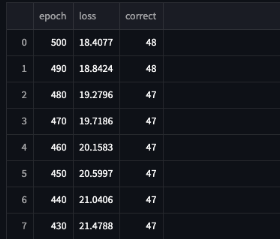

[](https://classroom.github.com/a/YFgwt0yY)

# MiniTorch Module 2


* Docs: https://minitorch.github.io/
* Overview: https://minitorch.github.io/module2/module2/

This assignment requires the following files from the previous assignments. You can get these by running

```bash
python sync_previous_module.py previous-module-dir current-module-dir
```

The files that will be synced are:

    minitorch/operators.py minitorch/module.py minitorch/autodiff.py minitorch/scalar.py minitorch/scalar_functions.py minitorch/module.py project/run_manual.py project/run_scalar.py project/datasets.py

## Plots - Simple

2 hidden layers with 15000 epochs. scoring 50/50


# Diag

2 hidden layers for 1500 epochs, scoring 50/50


# Split

I did 10 hidden layers for 500 epochs, scoring 48/50

 




# Xor

I did 10 hidden layers for 200 epochs witha learning rate of 0.05, getting 50/50


